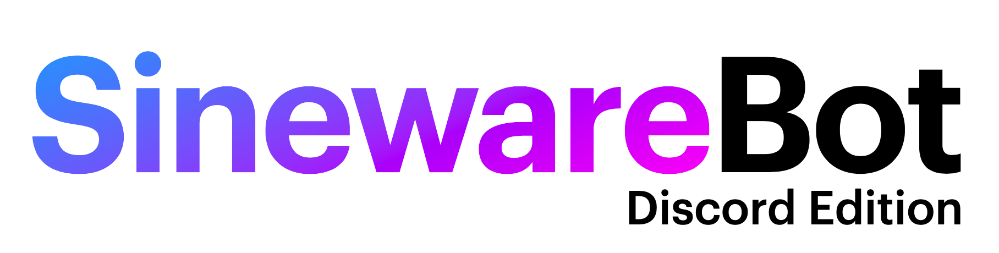
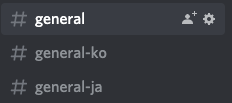

## SinewareBot aka. dr. smoothie

A Discord bot with a handful of features. Originally developed as BSSCCBot 
for the Bayview Computer Club Discord server. The latest development 
version is usually running on the ["espidev's things"](https://discord.gg/f2SZxU83Zr) Discord server.

### Features

* Linux emulation (run Linux commands using "!linux [cmd]"). Uses [v86](https://github.com/copy/v86).
* Music Bot (run "!play [song name]" while in a VC. This kinda works)
* Chat Bot (Uses the [ChatterBot](https://chatterbot.readthedocs.io/en/stable/) Python chat bot library. Is trained against included data, and the Discord server chat.)
* Chat Logging (Logs all messages to a specified log channel)
* !xkcd for XKCD comics, !joke for a dad joke
* !dmoj-problem and !dmoj-user [username]
* Meme things (!fry @User, !celebrate [text] !celebrate-party [text])
* Moderation features (!admin)
* Real-time channel language translation (using [LibreTranslate](https://github.com/LibreTranslate/LibreTranslate))

### Commands
```
Uncategorized
----------
!test
!admin

AGPL Compliance
----------
!generate-source - Generate an archive of the currently running bot source code
!source - Links to the development source code repository

Chat
----------
!chat - Talk to the bot! (!chat [msg])

DMOJ
----------
!dmoj-problem - Get a random DMOJ problem
!dmoj-user - Get stats for a DMOJ user (!dmoj-user [username])

Essentials
----------
!joke - Tells a random dad joke
!fortune - Tells you your fortune
!cowsay - Makes a cow say the message (!cowsay [text])
!xkcd - Gets an XKCD comic (!xkcd, !xkcd latest, !xkcd [comic number])
!roll - Roll a 6-sided die
!random - Get a random number (!random [max number])
!8ball - Let the Magic 8-Ball™️ answer your question
!wiki - Lookup the Wikipedia article for a topic (!wiki [topic])
!stats - See how many messages a user has sent (!stats @user)
!stats-top - Find the top chatters on the server
!clear - Clear the chat
!info - Display bot server information
!restart - (Admin only) Restart the bot

Linux
----------
!linux - Run a command in a BusyBox/Linux VM (!linux [command])
!enter - Press the enter key in the VM
!ctrlc - Press Ctrl+C in the VM
!linux-help - About the Linux subsystem

Math
----------
!math - Calculator (!math [math problem])
!latex - Render text as LaTeX (!latex [latex string])

Memes
----------
!fry - Fry/Cursify the users profile picture (!fry @user)
!celebrate - Microsoft Dance GIF (!celebrate [text])
!celebrate-party - Microsoft Dance Party GIF (!celebrate-party [text])

Music
----------
!play - Plays or Queues a song in a VC (!play [song name])
!stop - Stops playing music and leaves the VC
!skip - Skip the current song
!queue - Display the music queue

Informational
----------
!ping
!website
!about
```

### Translation
The Translation service in SinewareBot allows you to create multiple channels which mirror each other, but with 
messages translated between the channels. For example:



When a message in English is typed into #general, it is automatically translated to Korean and Japanese:

`#general`

`#general-ko`


The bot uses Webhooks to create messages in the channel with the user's name and avatar. Translation is handled by 
LibreTranslate, which is a open source machine learning translation service you can self-host. Configuration is done 
through environment variables.


Translation can also be done on an on-demand basis in any channel by reacting to messages with 🇰🇷 for Korean, 🇯🇵 for Japanese, and 
 🇺🇸/🇨🇦/🇬🇧 for English. The bot will respond with the translated message.

**The system is currently a very rough prototype and proof of concept! Eventually support for more languages and customization will be added.**

### Environment Variables
The bot needs the following environment variables set:
```dotenv
BOT_TOKEN=bot token (from discord developer portal)
BOT_ID=bot id (right click the bot in discord and copy id)
CHAT_LOG_CHANNEL=channel id (where to log messages to)
CHAT_BOT_ENABLE=enables the chat bot ("true" or "false", no quotes please)
CHAT_BOT_CHANNEL=channel id (where to run the chat bot)
LINUX_VM_ENABLE=enables the linux vm ("true" or "false", no quotes please)
MOD_ADMIN_ID=ID of the initial admin user
MOD_JAIL_ROLE=ID of the role to give to jailed users (this role should disable their send messages perm for example)

TRANSLATE_ENABLE=enables the translation service ("true" or "false", no quotes please)
TRANSLATE_API=http://url (libretranslate api server)
TRANSLATE_EN_WEBHOOKID=webhook id for the english channel
TRANSLATE_EN_WEBHOOKTOKEN=webhook token for the english channel
TRANSLATE_EN_CHANNELID=channel id for the english channel
TRANSLATE_JA_WEBHOOKID=japanese
TRANSLATE_JA_WEBHOOKTOKEN=
TRANSLATE_JA_CHANNELID=
TRANSLATE_KO_WEBHOOKID=korean
TRANSLATE_KO_WEBHOOKTOKEN=
TRANSLATE_KO_CHANNELID=

SQL_USER=MS SQL Server user
SQL_PASSWORD=MS SQL Server password
SQL_SERVER=MS SQL Server address (ex. localhost)
SQL_DB=bssccbot (don't change this, the database will be created for you)
```
A ".env" file can be used to set these when running locally.

#### Deploying with Docker
SinewareBot requires Microsoft SQL Server. The recommended way to deploy using docker is by using docker-compose, which 
will automatically setup a SinewareBot "bssccbot" container and MS SQL Server container, linked with a network.

First create a "docker.env" file with the above environment variables set (EXCLUDING SQL_*).

Then run `docker-compose pull && docker-compose up --no-start` to create the containers.

Finally, start the "bssccbot-mssql" container, wait for it to startup, then start the "bssccbot" container.

### Plugin Documentation:

Plugins consist of a folder in the bot-plugins directory, and an index.js file containing an init function.

**This plugin uses DiscordJS v11, make sure you are reading the correct documentation!**

Plugin Template:
```javascript
function init(client, cm, ap) {

}

module.exports = init;

```
client -> the instance of the [DiscordJS Client](https://discord.js.org/#/docs/main/v11/class/Client).

cm -> the Command Mapping object

ap -> argumentParser() helper utility.

To register a command:
```javascript
cm.push({
    "command": "",
    "category": "",
    "desc": "",
    "handler": async (msg) => {

    }
});
```
Command is the command **without** the prefix. Handler is a function that is 
called when the command is invoked (with [message object](https://discord.js.org/#/docs/main/stable/class/Message) passed to it).

Category and Description are used in the `!help` command output.

#### Argument Parser
The ap() function will return the command at index 0, and the rest of the text at index 1.
```javascript
let text = ap(msg.content)[1];
```
